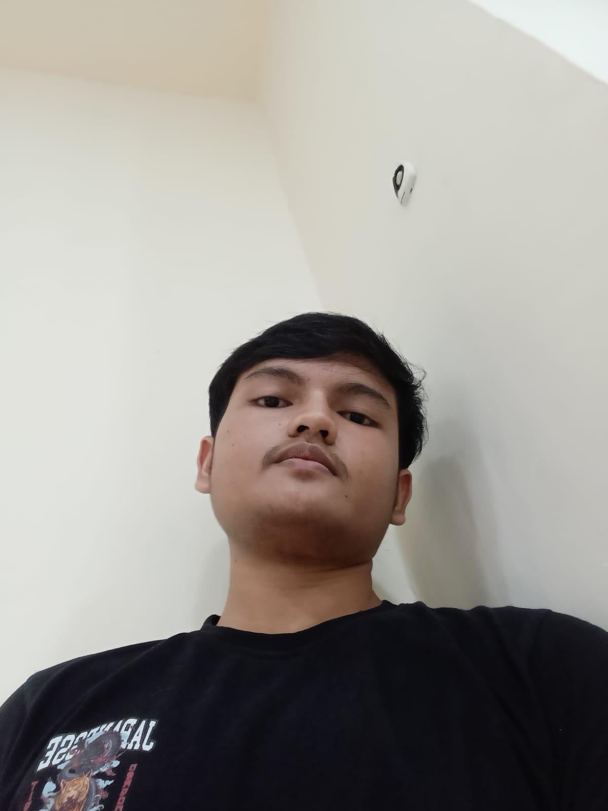

BERIKUT ADALAH ANALISIS DARI CODE PROGRAM PORTOFOLIO (HTML) SAYA:
<!DOCTYPE html>
Mendefinisikan bahwa dokumen menggunakan HTML5.
<html lang="id">
memberi tahu browser dan mesin pencari bahwa bahasa utama halaman ini adalah bahasa Indonesia.
<head>
berisi metadata, style, dan judul halaman.
<meta charset="utf-8" />
mendukung semua karakter (emoji, aksara lokal, dll)
<meta name="viewport" content="width=device-width, initial-scale=1" />
agar tampilan responsif di HP.
<title>Portfolio — Anugrah Restu Mannarai</title>
judul tab browser yaitu portofolio Anugrah Restu Mannarai.

CSS ditulis langsung di dalam file (inline style).
<body>
Isi utama halaman (konten yang ditampilkan).
:root {
  --bg-1: #071027;
  --bg-2: #0b1630;
  --card: rgba(255,255,255,0.04);
  --accent: #38bdf8;
  --accent-2: #7c3aed;
  --muted: #94a3b8;
  --radius: 14px;
  --shadow: 0 10px 30px rgba(2,6,23,0.6);
  --max-w: 960px;
}
Gunakan CSS variable biar mudah mengubah tema/warna global.
Contoh: kalau ganti --accent, maka semua elemen yang pakai var(--accent) akan berubah otomatis.
body {
  background: linear-gradient(180deg,var(--bg-1) 0%, var(--bg-2) 100%);
  background-size: 400% 400%;
  animation: bgShift 12s ease-in-out infinite;
}
@keyframes bgShift {
  0% {background-position:0% 50%}
  50% {background-position:100% 50%}
  100% {background-position:0% 50%}
}
Membuat background gradient animasi bergerak.
Efek ini memberi kesan modern & dinamis.
.container {
  max-width: var(--max-w);
  display: grid;
  grid-template-columns: 320px 1fr;
  gap: 24px;
}
display: grid → layout 2 kolom (profil di kiri, isi utama di kanan).
Saat layar kecil, berubah jadi 1 kolom (responsif).
Efek hover: sedikit naik (translateY(-6px)).
<aside class="profile">
  

  
Anugrah Restu Mannarai

  
Mahasiswa • UNIVERSITAS NEGERI MAKASSAR

  
Halo! Saya Anugrah ...

  
 ... 

  
 ... 

</aside>
.avatar {
  width:150px; height:150px; border-radius:999px;
  overflow:hidden; transition: transform 0.45s;
}
.avatar:hover { transform: translateY(-6px) scale(1.03); }
Foto profil bulat dengan efek hover membesar.
Ada nama Anugrah Restu Mannarai, status (Mahasiswa UNM), dan deskripsi singkat.
Contact chip: menampilkan lokasi & email.
Socials: link WhatsApp, TikTok, Instagram, GitHub dengan hover efek warna.
<main class="main">
  <section class="section"> ... Perkenalan ... </section>
  <section class="section"> ... Hobi ... </section>
  <section class="section"> ... Cita-cita ... </section>
</main>
.section {
  padding:14px; border-radius:12px;
  transition: box-shadow 0.25s, transform 0.25s;
}
.section:hover { transform: translateY(-4px); }
.section h2::after {
  content:''; position:absolute; bottom:-6px;
  width:36px; height:3px; background:var(--accent);
}
Setiap section punya border, efek hover, dan garis warna biru di bawah judul.
Perkenalan → biodata singkat + asal.
Hobi → daftar aktivitas favorit.
Cita-cita → tujuan karier di bidang IT.
<footer>©  Anugrah Restu Mannarai</footer>

Footer otomatis menampilkan tahun saat ini (misalnya 2025).
Jadi tidak perlu update manual tiap tahun.
@media (max-width:940px){
  .container{ grid-template-columns: 1fr; }
  .avatar{ width:120px; height:120px }
}
Jika layar lebih kecil dari 940px → layout jadi 1 kolom.
Foto profil ikut mengecil agar pas di layar HP.