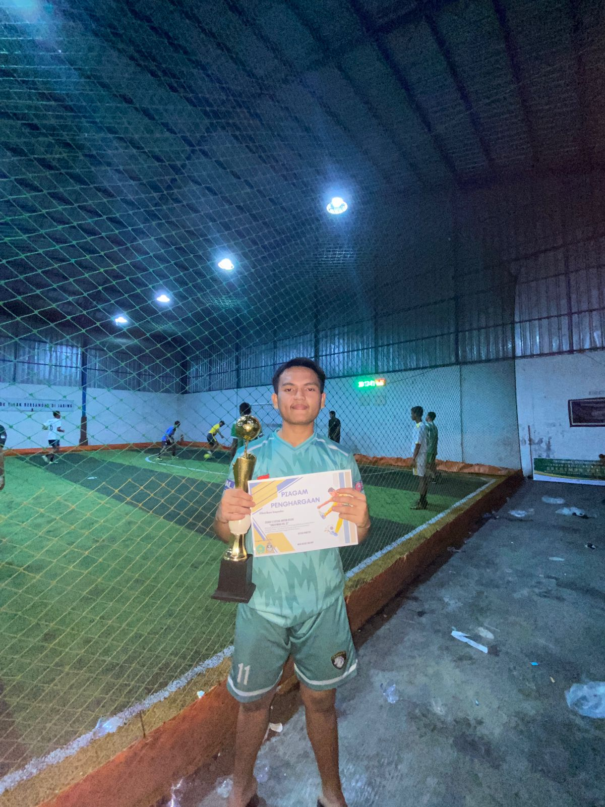
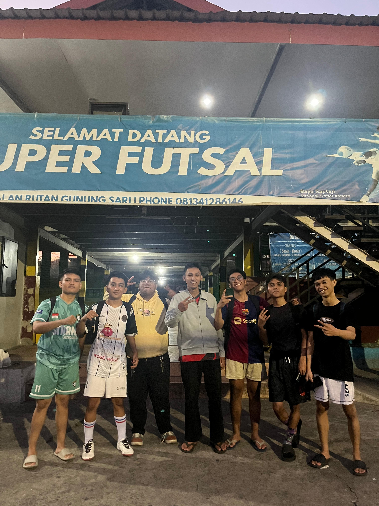
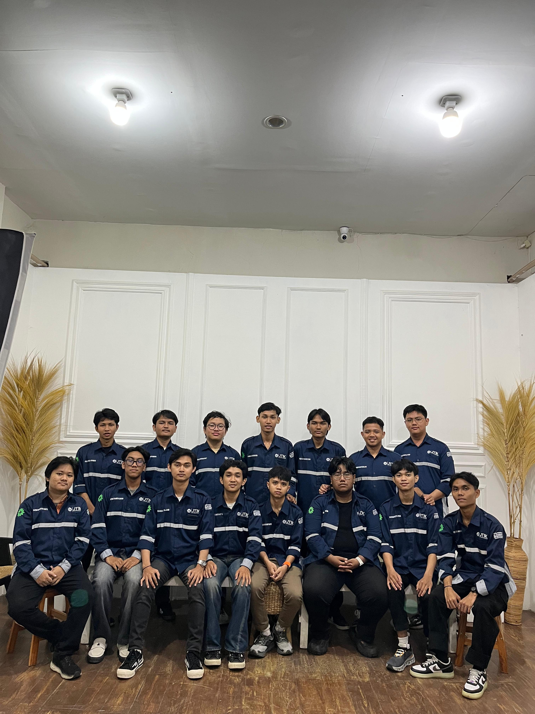

# Analisis code program pertemuan 4
<section class="section">
 Membuka sebuah section dengan class section. Section ini adalah bagian khusus dari halaman (dalam hal ini untuk Galeri).

html
Salin kode
        <h2>Galeri</h2>
 Heading level 2 (judul) dengan teks "Galeri". Ini menunjukkan sub-judul dari portofolio.

html
Salin kode
        
Lihat koleksi foto saya di halaman galeri.

 Paragraf yang berisi deskripsi singkat untuk mengajak pengunjung membuka halaman galeri.

html
Salin kode
        <a href="galeri.html" style="color:var(--accent); font-weight:600; text-decoration:none;">📷 Buka Galeri</a>
 Link menuju file galeri.html.

style="..." → inline CSS.
color:var(--accent); → warna link diambil dari variabel CSS --accent.
font-weight:600; → teks agak tebal.
text-decoration:none; → hilangkan garis bawah default pada link.
Isi link: emoji 📷 + teks "Buka Galeri".

html
Salin kode
      </section>
 Menutup section Galeri.

html
Salin kode
      <footer>©  Anugrah Restu Mannarai</footer>
 Bagian footer (kaki halaman) dengan isi:

Simbol copyright ©.

 → elemen span kosong yang nanti diisi otomatis dengan tahun sekarang lewat JavaScript.

Nama pemilik portofolio: Anugrah Restu Mannarai.

html
Salin kode
    </main>
  

 Menutup tag <main> (konten utama halaman) dan 
 (pembungkus).

html
Salin kode
  
 Script JavaScript:

document.getElementById('year') → mencari elemen dengan id="year".

.textContent = new Date().getFullYear(); → mengganti isi elemen span tadi dengan tahun sekarang (misalnya 2025).
Jadi footer otomatis menampilkan tahun berjalan.

html
Salin kode
</body>
</html>
 Menutup tag body dan html.

 # Analsis file galeri html
 <!DOCTYPE html>
Mendefinisikan bahwa dokumen ini menggunakan standar HTML5.

html
Salin kode
<html lang="id">
Tag pembuka html, dengan atribut lang="id" artinya bahasa utama dokumen ini adalah Bahasa Indonesia.

html
Salin kode
<head>
 Bagian head berisi metadata, judul halaman, style (CSS), dll.

html
Salin kode
  <meta charset="utf-8" />
 Mendefinisikan encoding karakter UTF-8 (supaya mendukung semua karakter termasuk emoji dan huruf internasional).

html
Salin kode
  <meta name="viewport" content="width=device-width, initial-scale=1" />
Membuat tampilan halaman responsif agar sesuai dengan ukuran layar (desktop, tablet, HP).

html
Salin kode
  <title>Galeri Foto — Anugrah Restu Mannarai</title>
Judul halaman yang muncul di tab browser adalah "Galeri Foto — Anugrah Restu Mannarai".

html
Salin kode
  <style>
Pembuka CSS internal (style langsung ditulis di dalam HTML).

Bagian CSS
css
Salin kode
    body {
      font-family: Arial, sans-serif;
      background: #0b1630;
      color: #e6eef8;
      margin: 0;
      padding: 20px;
      padding-top: 60px; /* supaya tidak ketimpa navbar */
      text-align: center;
    }
Style untuk body:

font-family: Arial, sans-serif; → font utama adalah Arial.
background: #0b1630; → latar belakang biru tua.
color: #e6eef8; → teks berwarna putih kebiruan.
margin: 0; → hilangkan jarak default browser.
padding: 20px; → beri jarak isi halaman dari tepi.
padding-top: 60px; → tambah ruang atas agar konten tidak ketimpa navbar.
text-align: center; → semua teks rata tengah.

css
Salin kode
    /* Navbar sama dengan index */
    .navbar {
      width: 100%;
      background: rgba(255,255,255,0.05);
      padding: 12px;
      text-align: center;
      position: fixed;
      top: 0;
      left: 0;
      z-index: 999;
      backdrop-filter: blur(6px);
    }
 Style untuk navbar:

Lebar penuh (width: 100%).
Latar belakang transparan putih (rgba(255,255,255,0.05)).
padding: 12px; → spasi dalam navbar.
Teks rata tengah.
position: fixed; → navbar selalu menempel di atas layar.
top: 0; left: 0; → posisinya di pojok kiri atas.
z-index: 999; → agar navbar selalu di atas elemen lain.
backdrop-filter: blur(6px); → efek blur transparan.

css
Salin kode
    .navbar a {
      display: inline-block;
      margin: 0 10px;
      padding: 8px 14px;
      border-radius: 8px;
      text-decoration: none;
      font-weight: 600;
      font-size: 14px;
      background: #38bdf8;
      color: #052028;
      transition: transform 0.2s, background 0.2s;
    }
 Style untuk link di navbar (<a>):

Bentuk kotak dengan inline-block.
Ada jarak antar link (margin: 0 10px).
padding: 8px 14px; → ruang di dalam tombol.
border-radius: 8px; → sudut membulat.
text-decoration: none; → hilangkan garis bawah.
font-weight: 600; → tebal.
Warna dasar tombol biru muda #38bdf8.
Warna teks gelap #052028.
transition → animasi halus saat hover.

css
Salin kode
    .navbar a:hover {
      transform: translateY(-3px);
      background: #7c3aed;
      color: #fff;
    }
Saat kursor diarahkan ke tombol navbar:
Tombol naik sedikit ke atas (translateY(-3px)).
Background berubah ungu #7c3aed.
Teks berubah putih.

css
Salin kode
    h1 { color: #38bdf8; margin-bottom: 20px; }
Style untuk heading <h1>: teks biru muda dengan jarak bawah 20px.

css
Salin kode
    .gallery {
      display: grid;
      grid-template-columns: repeat(auto-fit, minmax(220px, 1fr));
      gap: 16px;
      max-width: 960px;
      margin: 0 auto;
    }
Style untuk galeri foto:
display: grid; → pakai grid layout.
grid-template-columns: repeat(auto-fit, minmax(220px, 1fr)); → kolom otomatis menyesuaikan, minimal lebar 220px.
gap: 16px; → jarak antar foto.
max-width: 960px; → maksimal lebar galeri 960px.
margin: 0 auto; → rata tengah.

css
Salin kode
    .gallery img {
      width: 100%;
      border-radius: 12px;
      box-shadow: 0 6px 18px rgba(0,0,0,0.4);
      transition: transform 0.3s;
    }
    .gallery img:hover { transform: scale(1.05); }
Style untuk gambar:
width: 100%; → gambar memenuhi kolom grid.
border-radius: 12px; → sudut membulat.
box-shadow → bayangan halus di sekitar foto.
transition: transform 0.3s; → animasi halus.
Saat hover: gambar diperbesar sedikit (scale(1.05)).

Bagian Body
html
Salin kode
<body>
 Awal konten utama halaman.

html
Salin kode
  <!-- 🔹 Navbar Global -->
  

    <a href="portofolio1.html">⬅ Portofolio</a>
    <a href="gallery.html">Galeri</a>
  

Membuat navbar global dengan 2 link:
Tombol Portofolio menuju portofolio1.html.
Tombol Galeri menuju gallery.html.

html
Salin kode
  <h1>Galeri Foto</h1>
 Judul halaman, ditampilkan besar dan berwarna biru muda.

html
Salin kode
  

    
    
    
    
  

 Bagian galeri foto:
Setiap  menampilkan gambar (foto1.jpeg, foto2.jpeg, dst.).
Atribut alt="Foto 1" → teks alternatif jika gambar gagal dimuat.

html
Salin kode
</body>
</html>
Penutup body dan html.

